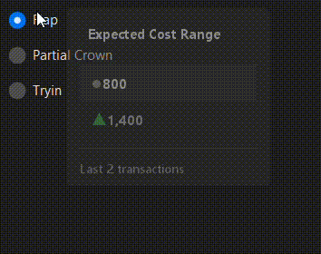
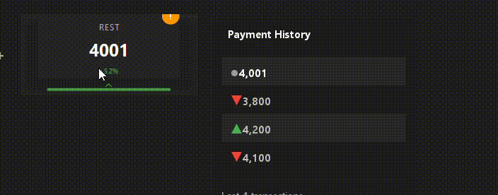

# Dolatip

A custom **animated tooltip** for Java Swing.
It provides a modern look with fade-in/out animations, expandable transaction history, and smooth resizing.

## ✨ Features

* 🪄 Fade-in / fade-out animations
* 📈 Trend indicators (▲ ▼ ●) for numeric values
* 📜 Expandable view when data exceeds a threshold
* 🎨 Customizable styles via `Config` (colors, width, font, etc.)
* 🖼 Rounded corners & shadow effect

## 📸 Demo

Collapsed:


Expanded:


## ⚡ Usage

```java
import javax.swing.*;
import java.util.Arrays;

public class Main {
    public static void main(String[] args) {
        JFrame frame = new JFrame("Dolatip Demo");
        frame.setDefaultCloseOperation(JFrame.EXIT_ON_CLOSE);
        JButton button = new JButton("Hover me!");
        frame.add(button);
        frame.setSize(300, 200);
        frame.setVisible(true);

        Dolatip.Config config = new Dolatip.Config("Transactions")
                .width(200)
                .maxBeforeClick(3)
                .maxAfterClick(8);

        Dolatip.attachTo(button, Arrays.asList(10.0, 12.5, 11.8, 14.3), config);
    }
}
```

## ⚙️ Config Options

| Option            | Description                                | Default   |
| ----------------- | ------------------------------------------ | --------- |
| `backgroundColor` | Tooltip background color                   | Dark gray |
| `width(int)`      | Tooltip width in px                        | 160       |
| `maxBeforeClick`  | Items shown before click (collapsed view)  | 2         |
| `maxAfterClick`   | Items shown after click (expanded view)    | 6         |
| `cornerRadius`    | Rounded corner radius                      | 8         |
| `offset(x, y)`    | Tooltip offset from parent component       | (5,0)     |
| `transparency`    | Background transparency percentage (0–100) | 0         |

## 📦 Installation

Just copy `Dolatip.java` into your project under a suitable package, e.g.:

```
src/Main/themes/Dolatip.java
```

## 📝 License

MIT License – feel free to use and modify.
